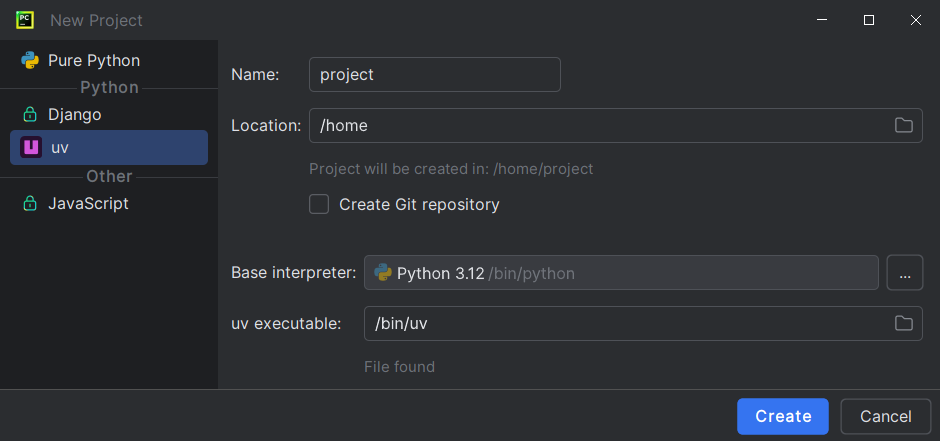

In the <i>New Project</i> dialog,
there will be an <i>uv</i> option on the left column.

This panel has the same basic functionalities
as the default (<i>Pure Python</i>) panel.

!!! note

    Due to technical limitations, it is not possible to extend the standard panel.
    You cannot use the <i>uv</i> panel with other frameworks.
