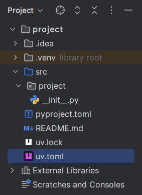
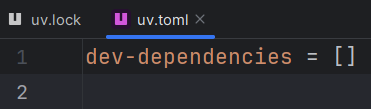
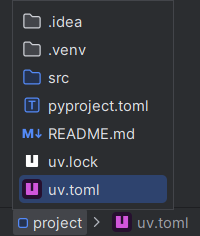

## File icons

In the [<i>Project</i> tool window][1] and other places,
the icons for `uv.lock` and `uv.toml` files are replaced with uv logos.

<figure markdown="1">
  <figcaption><i>Project</i> tool window:</figcaption>
  
</figure>

<figure markdown="1">
  <figcaption>Editor tabs:</figcaption>
  
</figure>

<figure markdown="1">
  <figcaption>Breadcrumbs:</figcaption>
  
</figure>

  [1]: https://www.jetbrains.com/help/pycharm/project-tool-window.html
